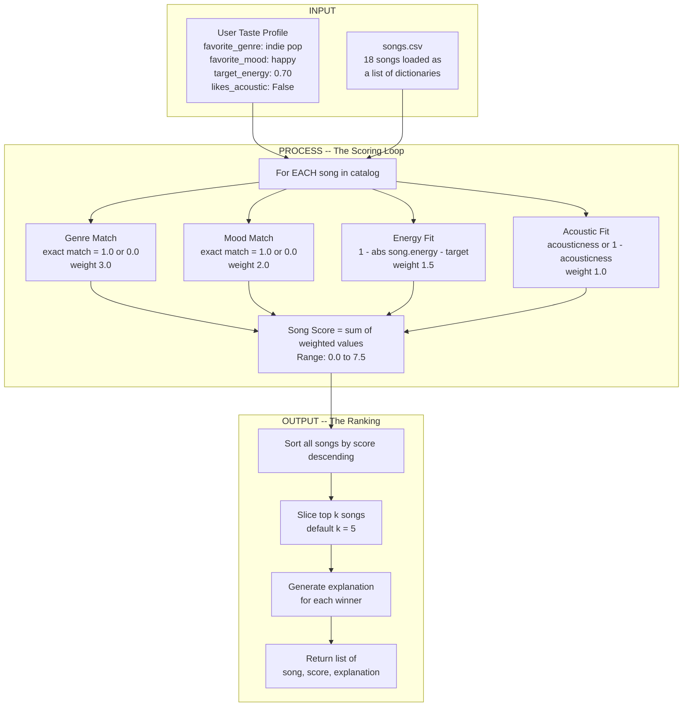

# Data Flow Map — Music Recommender

```mermaid
flowchart TD
    subgraph INPUT ["INPUT"]
        A["User Taste Profile\nfavorite_genre: indie pop\nfavorite_mood: happy\ntarget_energy: 0.70\nlikes_acoustic: False"]
        B["songs.csv\n18 songs loaded as\na list of dictionaries"]
    end

    subgraph PROCESS ["PROCESS -- The Scoring Loop"]
        C["For EACH song in catalog"]
        D["Genre Match\nexact match = 1.0 or 0.0\nweight 3.0"]
        E["Mood Match\nexact match = 1.0 or 0.0\nweight 2.0"]
        F["Energy Fit\n1 - abs song.energy - target\nweight 1.5"]
        G["Acoustic Fit\nacousticness or 1 - acousticness\nweight 1.0"]
        H["Song Score = sum of weighted values\nRange: 0.0 to 7.5"]
    end

    subgraph OUTPUT ["OUTPUT -- The Ranking"]
        I["Sort all songs by score descending"]
        J["Slice top k songs\ndefault k = 5"]
        K["Generate explanation\nfor each winner"]
        L["Return list of\nsong, score, explanation"]
    end

    A --> C
    B --> C
    C --> D
    C --> E
    C --> F
    C --> G
    D --> H
    E --> H
    F --> H
    G --> H
    H --> I
    I --> J
    J --> K
    K --> L
```
